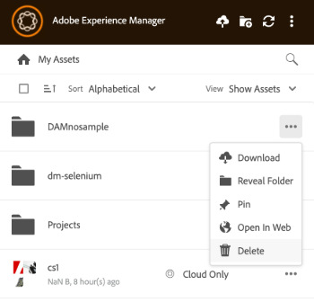

# Tareas de administración de Assets en [!DNL AEM Desktop App] {#assets-management-tasks}

La administración de recursos implica organizar, mantener y optimizar los recursos digitales para optimizar los flujos de trabajo. Incluye tareas como duplicar y cambiar el nombre de archivos, fijar o desanclar carpetas para un acceso rápido y ver recursos en varios diseños. Esto ayuda a mejorar la eficacia, simplificar el seguimiento de recursos y garantizar una fácil recuperación y organización de los recursos digitales entre plataformas.

## Visualización de recursos {#view-assets}

La aplicación de escritorio de AEM le permite ver recursos en cuatro vistas diferentes:

* **[!UICONTROL Show Assets]:** Permite ver todos los recursos.
* **[!UICONTROL Show Collections]:** Permite ver todas las colecciones creadas en la aplicación nativa de AEM. Ver más [colecciones](#collections-desktop-app).
* **[!UICONTROL Edited Locally]:** Permite mostrar todos los recursos modificados localmente. En esta vista, puede agregar y cargar varios recursos.
* **[!UICONTROL Asset transfers]:** Permite ver todos los recursos que se transfieren de la aplicación nativa a la local o viceversa.
* **[!UICONTROL Pinned items]:** Permite ver todos los elementos anclados.

Para elegir entre varias vistas de recursos en la aplicación de escritorio de AEM, ejecute los siguientes pasos:

1. Abra AEM Desktop App.

1. Vaya a la lista desplegable de vista en la parte superior derecha. Elija una de las vistas disponibles.

   

## Ver carpetas y archivos agregados recientemente {#view-newly-added-files-folders}

Puede cargar los recursos recién creados desde el equipo local a AEM, donde se almacena el repositorio central. Para ver estos recursos recién creados localmente, vaya al menú desplegable **[!UICONTROL View]** y seleccione **[!UICONTROL Show Assets]** para ver todas las actualizaciones con su cronología y títulos, o bien seleccione **[!UICONTROL Edited Locally]**. Ambas opciones muestran explícitamente los recursos editados localmente.

## Archivos duplicados {#duplicate-files}

Si desea conservar un archivo original y realizar cambios en un archivo similar, puede duplicar archivos en diferentes ubicaciones (local y en la nube) simultáneamente. Se puede realizar mediante la operación de duplicar archivos en todos los recursos.

Para duplicar archivos en AEM Desktop App, siga los pasos a continuación:

1. Busque una carpeta y seleccione el recurso que desea duplicar.

   

1. Haga clic en **[!UICONTROL More actions]**  y seleccione la acción  **[!UICONTROL Duplicate File]**.

1. El archivo duplicado se crea con un nombre de archivo y contenido idénticos.

## Cambiar el nombre del título de un recurso o una carpeta {#rename-asset-title}

Para cambiar el nombre del título de un recurso o una carpeta, ejecute los pasos siguientes:

1. Explore el recurso al que desea cambiar el nombre. Al nombrar una carpeta, no se permiten caracteres especiales como `\ / : * ?  | < > [ ] %`;. Si se incluyen, se reemplazarán automáticamente con un guión `-`.

1. Haga clic en **[!UICONTROL More actions]**  y seleccione **[!UICONTROL Rename]** para agregar el título de recurso que desee.

## Fijar o desanclar carpeta {#pin-unpin-folder}

Las carpetas ancladas se sincronizan automáticamente para reflejar los cambios realizados de forma nativa en la aplicación. Para acceder rápidamente, puede anclar o desanclar una carpeta ejecutando los pasos a continuación:

1. Explore el recurso que desea anclar o desanclar.

1. Haga clic en **[!UICONTROL More actions]**  y seleccione [!UICONTROL pin] para anclar el recurso o la carpeta. También puede hacer clic en [!UICONTROL unpin] para desanclarlo.

   

## Actualización automática {#auto-refresh}

La función de actualización automática actualiza automáticamente el contenido en tiempo real, lo que garantiza que siempre vea la información más reciente sin volver a cargar manualmente la página. Siga estos pasos para actualizar los recursos automáticamente y obtener la lista de recursos actualizados:

1. Abra AEM Desktop App.

1. Haga clic en  en la barra de menús para obtener las actualizaciones.

## Colecciones {#collections-desktop-app}

La aplicación de escritorio AEM te permite [ver](#view-collections-desktop-app), [descargar](#download-collections-desktop-app) y examinar colecciones que se crean en la aplicación [!DNL Adobe Experience Manager Assets].

### Ver colecciones {#view-collections-desktop-app}

Siga estos pasos para ver las colecciones en la aplicación de escritorio:

1. Abra AEM Desktop App y vaya a [ver recursos](#view-assets).

1. Seleccione **[!UICONTROL Show Collections]**. Se muestran las colecciones disponibles en la aplicación nativa.

   

### Descargar colecciones {#download-collections-desktop-app}

Siga estos pasos para descargar colecciones en la aplicación de escritorio:

1. Siga los pasos 1 y 2 que se muestran en [ver colecciones](#view-collections-desktop-app).

1. Vaya a más acciones  en la colección que desee descargar.

1. Haga clic en **[!UICONTROL Download]** para descargar la colección en particular.

## Crear carpeta con esquema de metadatos {#create-folder-with-metadata-schema}

Con AEM Desktop App, puede asignar metadatos al crear una carpeta nueva. Para ello, ejecute los siguientes pasos:

1. Vaya a crear icono de directorio . Aparece la pantalla **[!UICONTROL Create Directory]**.

1. Añada los siguientes detalles:
   * **[!UICONTROL Name]** de la carpeta.
   * **[!UICONTROL Folder Metadata Schema]** para elegir la jerarquía de metadatos de la carpeta o elija **[!UICONTROL none]** si no desea relacionarle ningún metadato.

1. Haga clic **[!UICONTROL OK]** para continuar.

## Lista de activos transferidos {#list-of-transferred-assets}

Para ver la lista de recursos transferidos en una sesión determinada, consulte [Cargar recursos a [!DNL Experience Manager]](#upload-and-add-new-assets-to-aem).

## Flujo de trabajo avanzado: colaborar en los mismos archivos y evitar conflictos de edición {#adv-workflow-collaborate-avoid-conflicts}

En entornos de colaboración, es posible que varios usuarios trabajen en el mismo conjunto de recursos que pueden provocar conflictos de versiones. Para evitar conflictos, siga estas prácticas recomendadas:

* No edite ningún recurso haciendo clic en [!UICONTROL Open]. No edite los recursos descargados localmente abriéndolos desde la carpeta del sistema de archivos. Otros usuarios no saben que el recurso se está editando.
* Para editar un recurso, siempre haga clic en [!UICONTROL Edit]. Abre el recurso en la aplicación nativa y agrega un icono de candado en el recurso, para que los demás usuarios sepan que el recurso se está editando.
* Haga clic en [!UICONTROL Toggle Check-in] si accidentalmente comienza a editar sin hacer clic en [!UICONTROL Edit]. Esta funcionalidad agrega un icono de bloqueo al recurso. Incluso si planea editar un recurso más tarde pero desea evitar que otros lo editen, haga clic en [!UICONTROL Toggle Check-in] para bloquear el recurso.
* Antes de editar un recurso, asegúrese de que otros usuarios no lo estén editando. Busque el icono de bloqueo en el recurso.
* Después de completar las ediciones, cargue todos los cambios y, a continuación, proteja el recurso.

Si se actualiza un recurso descargado localmente en el servidor [!DNL Experience Manager], la aplicación mostrará el estado **[!UICONTROL Modified remotely]**. Puede quitar la copia local o actualizar la copia local haciendo clic en [!UICONTROL Remove] o [!UICONTROL Update] respectivamente. Los vínculos del cuadro de diálogo permiten ver ambas versiones del recurso.

Si un recurso que está editando localmente también se actualiza en el servidor sin su conocimiento, la aplicación muestra un estado **[!UICONTROL Editing Conflict]**. Puede conservar un conjunto de cambios: o bien conservar las actualizaciones (haga clic en **[!UICONTROL Keep Mine]**) y eliminar la edición del otro usuario o respetar las actualizaciones del otro usuario y eliminar las suyas (**[!UICONTROL Overwrite Mine]**).

## Flujo de trabajo avanzado: colocar y vincular recursos en un archivo InDesign {#adv-workflow-place-assets-indesign}

Cuando utiliza la aplicación de escritorio [!DNL Experience Manager] para abrir archivos con recursos vinculados, los recursos se descargan previamente y aparecen colocados en las aplicaciones nativas. Para que este flujo de trabajo funcione, su aplicación nativa debe admitir la colocación de vínculos a recursos locales y [!DNL Experience Manager] debe admitir la resolución de estos vínculos en los archivos binarios a referencias del lado del servidor.

La aplicación de escritorio [!DNL Experience Manager] admite este flujo de trabajo con algunas aplicaciones de escritorio y formatos de archivo seleccionados de Adobe Creative Cloud: Adobe InDesign, Adobe Illustrator y Adobe Photoshop. El flujo de trabajo le permite trabajar de forma eficaz con los archivos Creative Cloud admitidos. Si el usuario A agrega recursos a un archivo InDesign y lo protege en [!DNL Experience Manager], el usuario B puede ver los recursos del archivo aunque no formen parte de él. Los recursos se descargan localmente en el equipo del usuario B.

>[!NOTE]
>
>La aplicación de escritorio puede asignarse a cualquier unidad de Windows. Sin embargo, para que las operaciones se realicen sin problemas, no cambie la letra de unidad predeterminada. Si los usuarios de la misma organización utilizan letras de unidad diferentes, no pueden ver los recursos colocados por otros. Los recursos colocados no se recuperan a medida que cambia la ruta. Los recursos colocados siguen colocados en el archivo binario (por ejemplo, INDD) y no se eliminan.

Para conocer las limitaciones de este flujo de trabajo, consulte [requisitos del sistema y versiones compatibles](release-notes.md).

Para probar este flujo de trabajo con un recurso de imagen y InDesign, siga estos pasos:

1. Mantenga a mano un archivo INDD con recursos colocados en [!DNL Experience Manager]. Para saber cómo crear un archivo INDD de este tipo, consulte [Colocación de gráficos](https://helpx.adobe.com/es/indesign/using/placing-graphics.html).
1. Desde la aplicación de escritorio, **[!UICONTROL Edit]** el archivo INDD con recursos colocados en [!DNL Experience Manager].
1. La aplicación descarga el archivo de InDesign y los recursos vinculados. Cuando InDesign abre el documento, los vínculos se resuelven, los recursos se descargan y los recursos se muestran en el documento de InDesign.
1. Para colocar un nuevo gráfico en el archivo InDesign, use la acción **[!UICONTROL Reveal File]** en el recurso. La acción descarga el recurso localmente y abre la ubicación del recurso compartido de red local en el Explorador de Windows o el Buscador de Mac.
1. Coloque el recurso mostrado en el documento de InDesign. Al hacerlo, se crea un vínculo en el documento.
1. Una vez que haya completado las ediciones en el documento de InDesign, guárdelo y cárguelo en [!DNL Experience Manager] mediante la aplicación de escritorio.

## Próximos pasos {#next-steps}

* [Vea un vídeo para empezar a usar la aplicación de escritorio de Adobe Experience Manager](https://experienceleague.adobe.com/es/docs/experience-manager-learn/assets/creative-workflows/aem-desktop-app)

* Proporcione comentarios sobre la documentación usando [!UICONTROL Edit this page]  o [!UICONTROL Log an issue] , disponibles en la barra lateral derecha

* Contacto con el [Servicio de atención al cliente](https://experienceleague.adobe.com/es?support-solution=General#support)

<!--* Provide product feedback using the [!UICONTROL Feedback] option available on the AEM Desktop App user interface>-->

>[!MORELIKETHIS]
>
>* [Explicación de la interfaz de usuario](/help/using/user-interface.md).
>* [Guía de introducción](/help/using/get-started.md).
