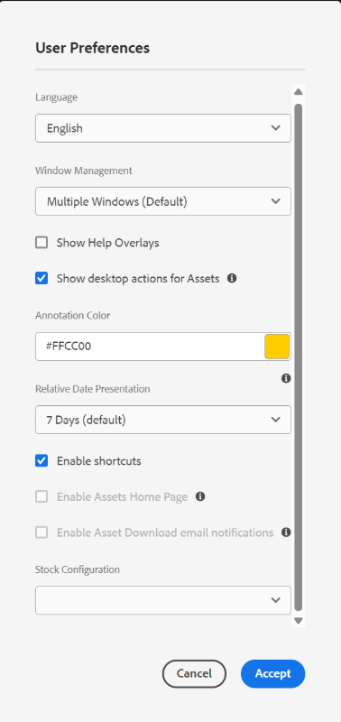

# Introducción a la aplicación de escritorio [!DNL Adobe Experience Manager] {#getting-started-desktop-app}

Utilice la aplicación de escritorio [!DNL Adobe Experience Manager] para acceder a los recursos digitales almacenados en un repositorio DAM [!DNL Adobe Experience Manager] del escritorio local. A continuación, puede utilizar estos recursos en cualquier aplicación de escritorio. Puede abrir y editar los recursos localmente en aplicaciones de escritorio. Después de realizar los cambios, cárguelos de nuevo a [!DNL Experience Manager] con control de versiones para compartir las actualizaciones con otros usuarios. También puede cargar nuevos archivos y jerarquías de carpetas en [!DNL Experience Manager], crear carpetas y eliminar recursos o carpetas de [!DNL Experience Manager] DAM.

La integración permite que varios roles de la organización administren los recursos de forma centralizada en [!DNL Experience Manager Assets] y tengan acceso a los recursos en el escritorio local en las aplicaciones nativas de Windows o macOS.

Cuando abra la aplicación después de cerrar sesión o por primera vez, proporcione la dirección URL del servidor [!DNL Experience Manager] con el formato `https://[aem-server-url]:[port]/`. Luego seleccione la opción [!UICONTROL Connect]. Proporcione credenciales para conectar la aplicación con el servidor.

Las tareas clave que realiza con la aplicación de escritorio [!DNL Adobe Experience Manager] son las siguientes:

![Flujos de trabajo y tareas que puede realizar mediante [!DNL Experience Manager] aplicación de escritorio](assets/aem_desktop_app_usecases_v2.png)

## Cómo funciona la aplicación de escritorio {#how-app-works2}

Antes de empezar a usar la aplicación, debes saber [cómo funciona](release-notes.md#how-app-works). Además, familiarícese con los siguientes términos:

* **[!UICONTROL Desktop Actions]**: desde la interfaz web de Assets, desde en un explorador, puede explorar las ubicaciones de los recursos o desprotegerlos y abrirlos para editarlos en la aplicación de escritorio nativa. Estas acciones están disponibles desde la interfaz web y utilizan la funcionalidad de la aplicación de escritorio de.

* El estado del archivo es **[!UICONTROL Cloud Only]**: estos recursos no se descargan en el equipo local y solo están disponibles en el servidor [!DNL Experience Manager].

* El estado del archivo es **[!UICONTROL Available locally]**: los recursos se descargan y están disponibles en el equipo local tal cual. Los recursos no se cambian.

* El estado del archivo es **[!UICONTROL Edited locally]**: estos recursos se modifican localmente y los cambios permanecen en el servidor subido a [!DNL Experience Manager]. Después de cargar, el estado cambia a [!UICONTROL Available locally]. Consulte [editar recursos](upload-assets.md#edit-assets-upload-updated-assets).

* El estado del archivo es **[!UICONTROL Editing conflict]**: si usted y otros editan un recurso simultáneamente, la aplicación indica que se ha producido un conflicto de edición. La aplicación también proporciona opciones para conservar o descartar los cambios. Ver [cómo evitar conflictos de edición](assets-management-tasks.md#adv-workflow-collaborate-avoid-conflicts).

* El estado del archivo es **[!UICONTROL Modified remotely]**: la aplicación indica si un recurso que ha descargado ha cambiado en el servidor [!DNL Experience Manager]. La aplicación también proporciona la opción de descargar la versión más reciente y actualizar la copia local. Ver [cómo evitar conflictos de edición](assets-management-tasks.md#adv-workflow-collaborate-avoid-conflicts).

* **[!UICONTROL Check-out]**: si está editando un archivo o desea editarlo, cambia el estado para desprotegerlo. Agrega un icono de candado en el recurso de la aplicación y la interfaz web [!DNL Experience Manager]. El icono de bloqueo indica a otros usuarios que eviten editar simultáneamente el mismo recurso, ya que provoca un conflicto de edición.

* **[!UICONTROL Check-in]**: marcar el recurso como seguro para que otros usuarios lo editen sin provocar un conflicto de edición. Al cargar los cambios, el icono de candado se elimina automáticamente. Al cambiar el estado de protección, también se elimina el icono de bloqueo, aunque Adobe recomienda evitar el registro manual sin cargar los cambios. Si descarta los cambios, active manualmente la protección.

* **[!UICONTROL Open]** acción: simplemente abra el recurso para previsualizarlo en la aplicación nativa. Adobe recomienda evitar editar el recurso mediante esta acción. El motivo es que no se desprotege el recurso. Mientras tanto, otros usuarios pueden hacer ediciones que conducen a conflictos de edición.

* **[!UICONTROL Edit]** acción: use la acción para modificar la imagen. Al hacer clic en [!UICONTROL Edit], se desprotege el recurso y se agrega un icono de bloqueo al recurso. Después de hacer clic en Editar, si no desea editar el recurso, haga clic en [!UICONTROL Toggle check-in]. Para eliminar, cambiar el nombre o mover recursos en la jerarquía de carpetas DAM [!DNL Experience Manager], use las acciones de la interfaz web [!DNL Experience Manager] y no la acción de edición.

* **[!UICONTROL Download]** acción: descargue el recurso en el equipo local. Puede descargar los recursos ahora y editarlos más tarde; trabaje sin conexión y cargue los cambios más tarde. Assets se descargan en una carpeta de la memoria caché del sistema de archivos.

* Acción **[!UICONTROL Reveal File]** o **[!UICONTROL Reveal Folder]**: mientras los recursos se descargan en una carpeta de caché local, la aplicación imita una unidad de red local. Proporciona una ruta local para cada recurso. Para conocer esta ruta, utilice la opción de visualización adecuada en la aplicación. La acción Mostrar es necesaria para colocar recursos en la aplicación de Creative Cloud. Ver [colocar recursos](search.md#place-assets-in-native-documents).

* **[!UICONTROL Open In Web]** acción: para ver el recurso en la interfaz web [!DNL Experience Manager], ábralo en el Web. Puede iniciar más flujos de trabajo desde la interfaz [!DNL Experience Manager], como la actualización de metadatos o la detección de recursos.

* **[!UICONTROL Delete]** acción: elimine el recurso del repositorio DAM [!DNL Experience Manager]. La acción elimina la copia original del recurso en el servidor de Experience Manager. Si solo desea descartar las modificaciones al recurso local, consulte [descartar cambios](upload-assets.md#edit-assets-upload-updated-assets).

* **[!UICONTROL Upload Changes]**: la aplicación de escritorio carga el recurso actualizado solo cuando se carga explícitamente en el servidor [!DNL Experience Manager]. Al guardar las ediciones, los cambios se guardan únicamente en el equipo local. Al cargar, el recurso se registra automáticamente y se elimina el icono de bloqueo. Consulte [editar recursos](upload-assets.md#edit-assets-upload-updated-assets).

## Habilitar acciones de escritorio en la interfaz web [!DNL Experience Manager] {#desktopactions-v2}

Desde la interfaz de usuario de [!DNL Assets] en un explorador, puede explorar las ubicaciones de los recursos o retirarlos y abrirlos para editarlos en la aplicación de escritorio. Estas opciones se denominan [!UICONTROL Desktop Actions] y no están habilitadas de manera predeterminada. Para habilitarlo, siga estos pasos.

1. En la consola [!DNL Assets], haga clic en el icono **[!UICONTROL User]** de la barra de herramientas.
1. Haga clic en **[!UICONTROL My Preferences]** para mostrar el cuadro de diálogo **[!UICONTROL Preferences]**.

1. En el cuadro de diálogo [!UICONTROL User Preferences], seleccione **[!UICONTROL Show Desktop Actions For Assets]** y haga clic en **[!UICONTROL Accept]**.

   

## Iniciar desde la interfaz web [!DNL Assets] {#adv-workflow-start-from-aem-ui}

Si es necesario, inicie el flujo de trabajo desde la interfaz web de Assets. La aplicación de escritorio se integra con [!DNL Experience Manager] para asumir el control cuando se solicita mediante acciones de escritorio.

Un caso especial de inicio de un flujo de trabajo desde la interfaz web es la detección de recursos. La barra Omnisearch de la interfaz de usuario de Assets ofrece una experiencia de búsqueda enriquecida y avanzada. Es posible que primero quiera localizar un recurso en la web y luego iniciar el flujo de trabajo en la aplicación con [!UICONTROL Desktop Actions]. Algunos casos de ejemplo incluyen el filtrado de resultados de búsqueda mediante facetas, la localización de un recurso específico con licencia de Adobe Stock o una personalización implementada por su organización que le permite un mejor descubrimiento desde la interfaz web.

La funcionalidad de la aplicación de escritorio se utiliza al intentar las siguientes acciones en la interfaz web de Assets:

* [!UICONTROL Desktop Actions] que permiten [!UICONTROL Open], [!UICONTROL Edit] y [!UICONTROL Reveal]
* [!UICONTROL Upload folder]
* [!UICONTROL Check-out] o [!UICONTROL check-in]

Por ejemplo, las acciones en la interfaz web disponibles para un recurso desprotegido en la aplicación son [!UICONTROL Open], [!UICONTROL Reveal] y [!UICONTROL Check in].

![Acciones de escritorio en la interfaz web de [!DNL Experience Manager]](assets/assets_web_actions_da2.png "Acciones de escritorio en la interfaz web de Experience Manager")

>[!NOTE]
>
>Es posible que el explorador le pida que permita el inicio del escritorio [!DNL Adobe Experience Manager]. Para realizar una transferencia ininterrumpida del explorador a la aplicación cada vez, active la casilla de verificación adecuada para permitir que la aplicación se haga cargo.

No puede encontrar la siguiente información o flujo de trabajo mediante la interfaz web. Utilice la aplicación de escritorio, ya que la interfaz web no realiza un seguimiento de los cambios locales y no tiene en cuenta lo siguiente:

* Los archivos se editan localmente.
* Archivos que tienen un conflicto de edición y una forma de resolverlo.
* Cargar cambios locales en [!DNL Experience Manager].
* Varios estados de los archivos disponibles localmente.

Por el contrario, puede abrir el recurso en la interfaz web desde la aplicación de escritorio con la acción **[!UICONTROL Open In Web]**.

## Próximos pasos {#next-steps}

* [Vea un vídeo para empezar a usar la aplicación de escritorio de Adobe Experience Manager](https://experienceleague.adobe.com/es/docs/experience-manager-learn/assets/creative-workflows/aem-desktop-app)

* Proporcione comentarios sobre la documentación usando [!UICONTROL Edit this page]  o [!UICONTROL Log an issue] , disponibles en la barra lateral derecha

* Contacto con el [Servicio de atención al cliente](https://experienceleague.adobe.com/es?support-solution=General#support)

>[!MORELIKETHIS]
>
>* [Comprenda la interfaz de usuario](/help/using/user-interface.md)
>* [Notas de la versión y problemas conocidos](/help/using/release-notes.md)
>* [Instalar o actualizar la aplicación de escritorio](/help/using/install-upgrade.md)
