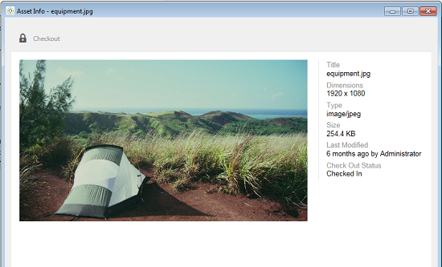

# Usar aplicación de escritorio [!DNL Experience Manager] v1.10 {#use-aem-desktop-app-v1x}

Con la aplicación, los recursos de [!DNL Experience Manager] son fácilmente accesibles desde el escritorio local y se pueden usar en cualquier aplicación de escritorio. Assets se puede mostrar fácilmente en el Finder de Mac o en el Explorador de Windows, abrirse en aplicaciones de escritorio y cambiarse localmente; los cambios se vuelven a guardar en [!DNL Experience Manager] con una nueva versión creada en el repositorio.

Esta integración permite la administración centralizada de recursos y el acceso entre Creative Cloud y otras aplicaciones, lo que garantiza la conformidad con la marca y otros estándares.

Las tareas clave que realiza con la aplicación de escritorio [!DNL Experience Manager] v1 son las siguientes:

1. [Conectar con un  [!DNL Experience Manager] servidor](#installandconnect)
1. [Abra los recursos directamente en la aplicación de escritorio](#openondesktop)
1. [Edición y extracción de recursos desde la aplicación de escritorio](#workonassets)
1. [Carga de recursos y carpetas por lotes](#bulkupload)

Para ver los distintos puntos y no acciones recomendados, consulte las [prácticas recomendadas para usar la aplicación de escritorio](best-practices-for-v1.md). Si tiene problemas al usar la aplicación, vea [solucionar problemas [!DNL Experience Manager] de la aplicación de escritorio](troubleshoot-app-v1.md).

>[!NOTE]
>
>La aplicación de escritorio se introdujo en la versión [!DNL Experience Manager] 6.1 y se llamó [!DNL Experience Manager Assets Companion App].

## [!DNL Experience Manager] puntos de contacto de aplicación de escritorio en el flujo de trabajo creativo {#aem-desktop-app-touch-points-in-the-creative-workflow}

La aplicación de escritorio [!DNL Experience Manager], junto con [!DNL Assets], se integra en su flujo de trabajo creativo y ofrece los siguientes puntos de contacto.

![[!DNL Experience Manager] puntos de contacto de aplicación de escritorio en el flujo de trabajo creativo](assets/aem_desktopapp_workflow.png)

[!DNL Experience Manager] puntos de contacto de aplicación de escritorio en el flujo de trabajo creativo

## Instalar y conectar la aplicación al servidor [!DNL Experience Manager] {#installandconnect}

Antes de empezar a crear o editar los recursos creativos, conecte la aplicación de escritorio con el servidor [!DNL Assets] para descargar y cargar los recursos en el repositorio. Realice las siguientes tareas:

1. [Instale la aplicación](#installapp).
1. [Establece tus preferencias](#inapppref) y los detalles de conexión.
1. [Conéctese a un [!DNL Experience Manager] servidor](#connect) y monte el repositorio de recursos como unidad local.
1. [Habilitar acciones de escritorio](#desktopactions) en el servidor [!DNL Experience Manager].

La aplicación de escritorio [!DNL Experience Manager] usa una conexión HTTPS para conectarse al servidor [!DNL Experience Manager] y transferir sus recursos de forma sólida y segura.

>[!NOTE]
>
>Para todos o parte de los pasos de instalación y configuración, es posible que necesite ayuda de su administrador de [!DNL Experience Manager] o del administrador del sistema.

### Instalación de la aplicación {#installapp}

Asegúrese de que la aplicación sea compatible con su versión del servidor de Experience Manager para utilizar la aplicación de escritorio de Experience Manager. Descargue el archivo de instalación adecuado (binario) para su sistema operativo (Mac o Windows) e instale la aplicación.

Puede ser necesaria una configuración detallada en función de las preferencias de la red y del sistema. Consulte [Instalar y configurar [!DNL Experience Manager] aplicación de escritorio](install-configure-app-v1.md) para obtener más información.

1. Vaya a la [[!DNL Experience Manager] página de descarga de la aplicación de escritorio v1.10](/help/using/release-notes-of-v1.md) y descargue el archivo binario apropiado para su sistema operativo.
1. Inicie el archivo de instalación descargado y siga las instrucciones que aparecen en pantalla para instalar la aplicación.

   >[!NOTE]
   >
   >Solo se puede instalar y activar una instancia de la aplicación de escritorio [!DNL Experience Manager] a la vez.

### Comprenda las opciones y preferencias en la aplicación {#inapppref}

La aplicación permite que la configuración se conecte y desconecte de [!DNL Experience Manager] servidores, vea el estado de las cargas, administre la caché local, etc. La configuración predeterminada funciona para un usuario típico de la aplicación. Puede modificar la configuración para sacar más partido a la aplicación. Además, aproveche al máximo la integración con el servidor [!DNL Experience Manager]. A continuación se indican las distintas configuraciones:

**Explorar Assets** Abra la unidad local en la que está montado el repositorio [!DNL Assets]. En otras palabras, explore los recursos que ahora están disponibles en su equipo local.

**Ver el estado del recurso** Cuando se cargan recursos modificados o se agregan nuevos recursos al repositorio [!DNL Assets], la aplicación carga los recursos en segundo plano. La carga en segundo plano permite realizar operaciones sin problemas, sin necesidad de esperar a que finalice la carga, especialmente para los recursos de gran tamaño. Puede guardar los cambios localmente y olvidarlos. La aplicación tarda algún tiempo en enviar estos recursos al servidor, según el ancho de banda disponible. Puede comprobar el estado de la carga junto con información más básica.

**Opciones** Haga clic en opciones en la bandeja de aplicaciones de escritorio para configurar la aplicación para que se inicie al iniciar, conectarse al servidor [!DNL Experience Manager] al iniciar y cambiar la letra de unidad local de [!DNL Assets] después de montar.

**Avanzado > Administrar caché** Puede controlar la cantidad de espacio en disco disponible para el almacenamiento en caché local. Los artefactos del servidor [!DNL Assets] se almacenan localmente en caché para una experiencia más fluida. Puede cambiar los valores predeterminados para adaptarlos a sus necesidades. Además, puede borrar la caché para recuperar todos los recursos de nuevo. Cuando borra la caché, conserva los cambios no guardados. Los recursos que no se hayan registrado en el servidor [!DNL Experience Manager] se conservarán y no se eliminarán.

### Conectar con un servidor [!DNL Experience Manager] {#connect}

La aplicación admite la configuración proxy en Mac y Windows. La configuración se lee cuando se inicia la aplicación. Si modifica la configuración del proxy, reinicie la aplicación para que los cambios surtan efecto.

>[!NOTE]
>
>Si modifica la configuración del proxy, reinicie la aplicación para que los cambios surtan efecto. De lo contrario, la aplicación seguirá utilizando el servidor proxy configurado anteriormente.

1. Inicie la aplicación de escritorio [!DNL Experience Manager]. Para asignar la instancia de [!DNL Experience Manager] con la aplicación, especifique el servidor [!DNL Experience Manager] con el formato `https://[aem-server-url]:[port]`.

   ![Autenticar en Mac y proporcionar [!DNL Experience Manager] URL del servidor](assets/aem_desktop_app_server_url.png)

1. En la pantalla de inicio de sesión, especifique el nombre de usuario y la contraseña de la instancia. Para especificar una instancia [!DNL Experience Manager] alternativa, seleccione la opción **[!UICONTROL Alternate Login URL]**.

   ![Proporcione [!DNL Experience Manager] credenciales del servidor en la pantalla de inicio de sesión de [!DNL Experience Manager] aplicación de escritorio](assets/login_screen_v1.png)

### Habilitar acciones de escritorio en la interfaz web [!DNL Experience Manager] {#desktopactions}

Desde la interfaz de usuario de Assets, puede explorar las ubicaciones de los recursos o retirarlos y abrirlos para editarlos en la aplicación de escritorio. Estas opciones se denominan acciones de escritorio y no están habilitadas de forma predeterminada. Siga estos pasos para habilitarlo.

1. En la interfaz de Assets, pulse o haga clic en el icono Usuario en la esquina superior derecha de la barra de herramientas.
1. Haga clic en **[!UICONTROL My Preferences]** para mostrar el cuadro de diálogo **[!UICONTROL Preferences]**.

   ![[!DNL Experience Manager] interfaz con preferencias de usuario](assets/aem_ui_user_preferences.png)

1. En el cuadro de diálogo [!UICONTROL User Preferences], seleccione **[!UICONTROL Show Desktop Actions For Assets]** y haga clic en **[!UICONTROL Accept]**.

   ![Marque [!UICONTROL Show Desktop Actions For Assets] para habilitar las acciones del escritorio](assets/enable_desktop_actions.png)

   *Figura: Marque [!UICONTROL Show Desktop Actions For Assets] para habilitar las acciones del escritorio.*

## Acceso y apertura de recursos en el escritorio {#openondesktop}

Al hacer clic en **Abrir** para abrir un recurso en el equipo local, la aplicación descarga el recurso en su caché interna. La aplicación inicia la aplicación de escritorio nativa asociada al tipo de archivo del recurso descargado.

En Mac, seleccione **Abrir** en el menú contextual para abrir un recurso a través de la aplicación de escritorio [!DNL Experience Manager]. En Windows, seleccione Abrir en la web en el menú contextual para abrir el recurso. En la ventana Estado del recurso, pulse o haga clic en  para abrir el recurso.

Para archivos Adobe InDesign (INDD), seleccione **[!UICONTROL Open]** en el menú contextual. Al hacer clic en esta opción, la aplicación descarga los recursos vinculados al sistema de archivos local y, a continuación, abre el archivo INDD en Adobe InDesign. Este método garantiza que los recursos necesarios estén disponibles localmente al editar el archivo INDD.

![Opciones de menú contextual para acceder y abrir recursos mediante [!DNL Experience Manager] aplicación de escritorio](assets/aem_desktopapp_mac_context_menu.png)

*Figura: Opciones del menú contextual para acceder y abrir recursos mediante la aplicación de escritorio [!DNL Experience Manager].*

>[!NOTE]
>
>El Adobe recomienda ir a Opciones de vista de Finder en Mac y desactivar las opciones **Mostrar información de elemento**, **Mostrar vista previa de elemento** y **Mostrar columna de vista previa** para la carpeta [!DNL Assets] montada. Mejora el rendimiento.

### Opciones adicionales en la interfaz [!DNL Experience Manager] {#additional-options-in-aem-assets}

Después de asignar el repositorio [!DNL Assets] a la unidad local, puede habilitar iconos adicionales y la característica Carga de carpetas para que aparezcan en los recursos y carpetas asignados.

1. Abra la interfaz [!DNL Assets] y pase el puntero sobre una carpeta o un recurso para mostrar las acciones del escritorio como acciones rápidas en la vista de tarjeta.

   

   *Imagen: en la interfaz de usuario de Assets, abra el menú de acciones rápidas para ver las acciones del escritorio.*

   Estas acciones de escritorio también están disponibles cuando hace clic en la opción **Acciones de escritorio** de la barra de herramientas después de seleccionar el recurso o en la barra de herramientas de la página del recurso.

1. Para abrir el recurso en la aplicación de escritorio asociada con la extensión de archivo específica, haga clic en la acción rápida **Abrir en el escritorio** .

   También puede elegir **Abrir** en el menú **Acciones de escritorio** de la barra de herramientas.

Para localizar el recurso concreto en el sistema de archivos local, haga clic en **Mostrar** acción rápida . También puede elegir **Mostrar** en el menú **Acciones de escritorio** de la barra de herramientas.

## Comprender los estados de los recursos {#understand-the-asset-statuses}

|  | La aplicación está conectada al servidor y todos los recursos están sincronizados. |
--- |--- |
|  | La aplicación se inicia, pero no está conectada con el servidor. Es posible que algunos recursos estén pendientes de sincronización. |
|  | Assets se está sincronizando. Los archivos se están cargando o descargando. Puede ver los estados exactos y pausar las transferencias desde la ventana Estado de los Activos. |
|  | La aplicación está intentando volver a conectarse. Es posible que los problemas de red estén provocando la desconexión. |

## Trabaje en sus recursos {#workonassets}

### Desproteger recursos de la interfaz web [!DNL Experience Manager] {#check-out-assets-from-the-aem-web-interface}

[!DNL Experience Manager Assets] le permite extraer recursos para editarlos y volver a protegerlos una vez que haya completado los cambios. Después de desproteger un recurso, solo puede editarlo, anotarlo, publicarlo, moverlo o eliminarlo. La extracción de un recurso bloquea el recurso y evita que otros usuarios realicen cualquiera de estas operaciones. Para poder desproteger o proteger recursos, se requiere acceso de escritura en ellos.

Existen dos formas de extraer recursos de la interfaz web [!DNL Experience Manager]. Para obtener información detallada sobre el primer método, consulte los [archivos de protección y desprotección de la interfaz de usuario de Assets](https://experienceleague.adobe.com/en/docs/experience-manager-65/content/assets/managing/check-out-and-submit-assets). Siga estos pasos para los segundos métodos para desproteger y abrir el recurso cuando la aplicación de escritorio [!DNL Experience Manager] esté instalada.

1. Abra la interfaz [!DNL Assets] y pase el puntero sobre una carpeta o un recurso para mostrar las acciones del escritorio como acciones rápidas en la vista de tarjeta.

   

   Estas acciones de escritorio también están disponibles cuando pulsa o hace clic en el icono Acciones de escritorio de la barra de herramientas después de seleccionar el recurso o en la barra de herramientas de la página del recurso.

1. Para abrir el recurso, pulse o haga clic en la acción rápida Abrir en el escritorio .

   También puede elegir Abrir en el menú Acciones de escritorio de la barra de herramientas.

   >[!NOTE]
   >
   >Cuando edita un archivo abierto pero no desprotegido, los demás usuarios no saben que está actualizando el recurso.

1. Para abrir un recurso y editarlo en una aplicación de Adobe Creative Cloud, haga clic en . Esta opción también extrae el recurso para editarlo. Cuando termine de editar, proteja el recurso para actualizar los cambios en [!DNL Assets].

   También puede elegir Editar en el menú Acciones de escritorio de la barra de herramientas.

1. Seleccione la opción Abrir menú. Los recursos seleccionados se abren en el modo de vista previa.
1. Para editar los recursos, seleccione la opción Editar. Los recursos se abren en modo de edición.

### Consulte los recursos de Finder en macOS {#check-out-assets-on-mac}

La aplicación permite retirar archivos de recursos para evitar que otros usuarios modifiquen los archivos en los que está trabajando.

1. En el menú contextual de Mac, seleccione la opción Abrir carpeta de AEM Assets para abrir el Buscador.

   ![Opciones de menú contextual para acceder y abrir recursos mediante [!DNL Experience Manager] aplicación de escritorio](assets/aem_desktopapp_mac_context_menu.png)

   *Figura: Opciones del menú contextual para acceder y abrir recursos mediante la aplicación de escritorio [!DNL Experience Manager].*

1. Desplácese hasta el recurso que desee extraer.
1. Haga clic con el botón derecho en el recurso y seleccione Más información de Assets en el menú contextual.
1. En el cuadro de diálogo Información del recurso, pulse o haga clic en el icono Desproteger para desproteger el recurso. El icono Desproteger cambia al icono Proteger después de hacer clic en él o tocarlo.

   

1. Para proteger el recurso de modo que esté disponible para otros usuarios, pulse o haga clic en el icono Proteger del cuadro de diálogo Información del recurso.

### Desproteger recursos en Windows {#check-out-assets-on-windows}

La aplicación permite retirar archivos de recursos para evitar que otros usuarios modifiquen los archivos en los que está trabajando.

1. En el menú contextual, seleccione Explorar Assets para abrir el Explorador.
1. En el Explorador, vaya a la ubicación del recurso que desea desproteger.
1. Haga clic con el botón derecho en el recurso y seleccione Abrir en la web en el menú contextual.
1. En el cuadro de diálogo Información del recurso, haga clic en el icono Desproteger. El icono de cierre de compra cambia al icono de registro de entrada.

   

1. Revise el recurso en Explorer. El icono de candado del recurso  indica que ha retirado el recurso.

   >[!NOTE]
   >
   >El icono de bloqueo puede aparecer después de un cierto retraso. La aplicación de escritorio [!DNL Experience Manager] almacena en caché los recursos para obtener acceso rápido, por lo que puede tardar unos momentos en actualizar el estado bloqueado.

1. Para proteger el recurso de modo que esté disponible para otros usuarios, pulse o haga clic en el icono de protección en el cuadro de diálogo **Información del recurso**.

### Registrar un recurso mediante Finder o Explorer y utilizar la interfaz web {#check-in-an-asset-using-finder-or-explorer-and-using-web-interface}

Cuando haya terminado de editar los recursos, guárdelos en la aplicación de escritorio. En el menú contextual, seleccione **Más información de Assets** y haga clic en Proteger.

Los recursos se han cargado en el servidor [!DNL Experience Manager]. Opcionalmente, puede comprobar el estado de la carga seleccionando **Ver estado del recurso** en el icono de la bandeja del sistema. También puede proteger un recurso desde la interfaz web [!DNL Experience Manager]. Haga clic en los recursos retirados o selecciónelos. En la barra de herramientas, haga clic en el icono de protección .

Se cargó un recurso en [!DNL Experience Manager] automáticamente después de guardar los cambios de manera local. La protección hace que el recurso esté disponible para que lo editen otros [!DNL Experience Manager] usuarios.

### Cargar recursos y carpetas de forma masiva al servidor [!DNL Experience Manager] {#bulkupload}

Con la aplicación de escritorio [!DNL Experience Manager], puede cargar una carpeta entera que contenga recursos del directorio de archivos local en [!DNL Assets]. De este modo, todos los recursos de la carpeta se cargan de forma masiva, en lugar de tener que cargarlos de uno en uno.

1. En la interfaz de usuario de Assets, pulse o haga clic en **Crear** en la barra de herramientas y, a continuación, en el menú, seleccione **Cargar carpeta**.
1. Busque la carpeta que desee cargar y selecciónela.
1. Pulse o haga clic en Aceptar. El cuadro de diálogo Estado de Assets muestra el estado de la carga.

   

   Consulte el estado de la carga en la ventana Estado de los recursos

   >[!NOTE]
   >
   >Puede pausar o cancelar manualmente la carga tocando o haciendo clic en el icono correspondiente.

1. Una vez cargada la carpeta, cierre el cuadro de diálogo y vaya a la interfaz de usuario de Assets. La carpeta cargada se muestra en la interfaz web.

El Adobe no recomienda copiar y pegar ni arrastrar un número mayor de archivos o carpetas anidadas, desde el sistema de archivos local, al área de recursos compartidos de red. La aplicación no puede controlar el proceso de carga debido a limitaciones técnicas y a que el rendimiento es deficiente.

También puede seleccionar archivos o carpetas en Finder o Explorer, copiarlos, navegar a la carpeta de destino en el área de uso compartido de red y elegir **Pegar Assets** en el menú contextual de la aplicación de escritorio [!DNL Experience Manager]. De este modo, la aplicación de escritorio [!DNL Experience Manager] comienza a cargar los recursos pegados de forma similar a la opción **Cargar carpeta** disponible en la interfaz web [!DNL Experience Manager].

>[!MORELIKETHIS]
>
>* [Solucionar problemas [!DNL Experience Manager] aplicación de aplicación de escritorio](troubleshoot-app-v1.md)
