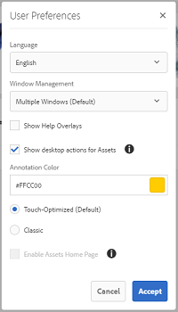

# Usar aplicación de escritorio [!DNL Adobe Experience Manager] {#use-aem-desktop-app-v2}

Utilice la aplicación de escritorio [!DNL Adobe Experience Manager] para acceder a los recursos digitales almacenados en un repositorio DAM [!DNL Adobe Experience Manager] del escritorio local. A continuación, puede utilizar estos recursos en cualquier aplicación de escritorio. Puede abrir y editar los recursos localmente en aplicaciones de escritorio. Después de realizar los cambios, cárguelos de nuevo a [!DNL Experience Manager] con control de versiones para compartir las actualizaciones con otros usuarios. También puede cargar nuevos archivos y jerarquías de carpetas en [!DNL Experience Manager], crear carpetas y eliminar recursos o carpetas de [!DNL Experience Manager] DAM.

La integración permite que varios roles de la organización administren los recursos de forma centralizada en [!DNL Experience Manager Assets] y tengan acceso a los recursos en el escritorio local en las aplicaciones nativas de Windows o macOS.

Cuando abra la aplicación después de cerrar sesión o por primera vez, proporcione la dirección URL del servidor [!DNL Experience Manager] con el formato `https://[aem-server-url]:[port]/`. Luego seleccione la opción [!UICONTROL Connect]. Proporcione credenciales para conectar la aplicación con el servidor.

Las tareas clave que realiza con la aplicación de escritorio [!DNL Adobe Experience Manager] son las siguientes:

![Flujos de trabajo y tareas que puede realizar con [!DNL Experience Manager] aplicación de escritorio](assets/aem_desktop_app_usecases_v2.png "Flujos de trabajo y tareas que puede realizar con [!DNL Adobe Experience Manager] aplicación de escritorio")

<!--Download [this](assets/aem_desktop_app_usecases_print.pdf) print-ready PDF file.-->

## Cómo funciona la aplicación de escritorio {#how-app-works2}

Antes de empezar a usar la aplicación, debes saber [cómo funciona](release-notes.md#how-app-works). Además, familiarícese con los siguientes términos:

* **[!UICONTROL Desktop Actions]**: desde la interfaz web de Assets, desde en un explorador, puede explorar las ubicaciones de los recursos o desprotegerlos y abrirlos para editarlos en la aplicación de escritorio nativa. Estas acciones están disponibles desde la interfaz web y utilizan la funcionalidad de la aplicación de escritorio de. Consulte [cómo habilitar las acciones de escritorio](using.md#desktopactions-v2).

* El estado del archivo es **[!UICONTROL Cloud Only]**: estos recursos no se descargan en el equipo local y solo están disponibles en el servidor [!DNL Experience Manager].

* El estado del archivo es **[!UICONTROL Available locally]**: los recursos se descargan y están disponibles en el equipo local tal cual. Los recursos no se cambian.

* El estado del archivo es **[!UICONTROL Edited locally]**: estos recursos se modifican localmente y los cambios permanecen en el servidor subido a [!DNL Experience Manager]. Después de cargar, el estado cambia a [!UICONTROL Available locally]. Consulte [editar recursos](using.md#edit-assets-upload-updated-assets).

* El estado del archivo es **[!UICONTROL Editing conflict]**: si usted y otros editan un recurso simultáneamente, la aplicación indica que se ha producido un conflicto de edición. La aplicación también proporciona opciones para conservar o descartar los cambios. Ver [cómo evitar conflictos de edición](using.md#adv-workflow-collaborate-avoid-conflicts).

* El estado del archivo es **[!UICONTROL Modified remotely]**: la aplicación indica si un recurso que ha descargado ha cambiado en el servidor [!DNL Experience Manager]. La aplicación también proporciona la opción de descargar la versión más reciente y actualizar la copia local. Ver [cómo evitar conflictos de edición](using.md#adv-workflow-collaborate-avoid-conflicts).

* **[!UICONTROL Check-out]**: si está editando un archivo o desea editarlo, cambia el estado para desprotegerlo. Agrega un icono de candado en el recurso de la aplicación y la interfaz web [!DNL Experience Manager]. El icono de bloqueo indica a otros usuarios que eviten editar simultáneamente el mismo recurso, ya que provoca un conflicto de edición.

* **[!UICONTROL Check-in]**: marcar el recurso como seguro para que otros usuarios lo editen sin provocar un conflicto de edición. Al cargar los cambios, el icono de candado se elimina automáticamente. Al cambiar el estado de protección, también se elimina el icono de bloqueo, aunque Adobe recomienda evitar el registro manual sin cargar los cambios. Si descarta los cambios, active manualmente la protección.

* **[!UICONTROL Open]** acción: simplemente abra el recurso para previsualizarlo en la aplicación nativa. Adobe recomienda evitar editar el recurso mediante esta acción. El motivo es que no se desprotege el recurso. Mientras tanto, otros usuarios pueden hacer ediciones que conducen a conflictos de edición.

* **[!UICONTROL Open with]** acción: la característica &quot;Abrir con&quot; permite abrir un archivo con una aplicación específica que no sea la predeterminada. Esto resulta útil para elegir un programa preferido, acceder a archivos en diferentes formatos, solucionar problemas con la aplicación predeterminada o trabajar con varios programas. Proporciona flexibilidad al permitirle anular temporalmente la aplicación predeterminada sin cambiar la configuración de forma permanente.

* **[!UICONTROL Open In Web]** acción: para ver el recurso en la interfaz web [!DNL Experience Manager], ábralo en el Web. Puede iniciar más flujos de trabajo desde la interfaz [!DNL Experience Manager], como la actualización de metadatos o la detección de recursos.

* **[!UICONTROL Edit]** acción: use la acción para modificar la imagen. Al hacer clic en [!UICONTROL Edit], se desprotege el recurso y se agrega un icono de bloqueo al recurso. Después de hacer clic en Editar, si no desea editar el recurso, haga clic en [!UICONTROL Toggle check-in]. Para eliminar, cambiar el nombre o mover recursos en la jerarquía de carpetas DAM [!DNL Experience Manager], use las acciones de la interfaz web [!DNL Experience Manager] y no la acción de edición.

* **[!UICONTROL Download]** acción: descargue el recurso en el equipo local. Puede descargar los recursos ahora y editarlos más tarde; trabaje sin conexión y cargue los cambios más tarde. Assets se descargan en una carpeta de la memoria caché del sistema de archivos.

* Acción **[!UICONTROL Reveal File]** o **[!UICONTROL Reveal Folder]**: mientras los recursos se descargan en una carpeta de caché local, la aplicación imita una unidad de red local. Proporciona una ruta local para cada recurso. Para conocer esta ruta, utilice la opción de visualización adecuada en la aplicación. La acción Mostrar es necesaria para colocar recursos en la aplicación de Creative Cloud. Ver [colocar recursos](using.md#place-assets-in-native-documents).

* **[!UICONTROL Delete]** acción: elimine el recurso del repositorio DAM [!DNL Experience Manager]. La acción elimina la copia original del recurso en el servidor de Experience Manager. Si solo desea descartar las modificaciones al recurso local, consulte [descartar cambios](using.md#edit-assets-upload-updated-assets).

* **[!UICONTROL Upload Changes]**: la aplicación de escritorio carga el recurso actualizado solo cuando se carga explícitamente en el servidor [!DNL Experience Manager]. Al guardar las ediciones, los cambios se guardan únicamente en el equipo local. Al cargar, el recurso se registra automáticamente y se elimina el icono de bloqueo. Consulte [editar recursos](using.md#edit-assets-upload-updated-assets).

## Habilitar acciones de escritorio en la interfaz web [!DNL Experience Manager] {#desktopactions-v2}

Desde la interfaz de usuario de [!DNL Assets] en un explorador, puede explorar las ubicaciones de los recursos o retirarlos y abrirlos para editarlos en la aplicación de escritorio. Estas opciones se denominan [!UICONTROL Desktop Actions] y no están habilitadas de manera predeterminada. Para habilitarlo, siga estos pasos.

1. En la consola [!DNL Assets], haga clic en el icono **[!UICONTROL User]** de la barra de herramientas.
1. Haga clic en **[!UICONTROL My Preferences]** para mostrar el cuadro de diálogo **[!UICONTROL Preferences]**.

1. En el cuadro de diálogo [!UICONTROL User Preferences], seleccione **[!UICONTROL Show Desktop Actions For Assets]** y haga clic en **[!UICONTROL Accept]**.

   

   *Figura: Seleccione [!UICONTROL Show Desktop Actions For Assets] para habilitar las acciones de escritorio.*

## Visualización de recursos {#view-assets}

La aplicación de escritorio de AEM le permite ver recursos en cuatro vistas diferentes:

* **[!UICONTROL Show Assets]:** Permite ver todos los recursos.
* **[!UICONTROL Show Collections]:** Permite ver todas las colecciones creadas en la aplicación nativa de AEM. Ver más [colecciones](#collections-desktop-app).
* **[!UICONTROL Edited Locally]:** Permite mostrar todos los recursos modificados localmente. En esta vista, puede agregar y cargar varios recursos.
* **[!UICONTROL Asset transfers]:** Permite ver todos los recursos que se transfieren de la aplicación nativa a la local o viceversa.
* **[!UICONTROL Pinned items]:** Permite ver todos los elementos anclados.

Para elegir entre varias vistas de recursos en la aplicación de escritorio de AEM, ejecute los siguientes pasos:

1. Abra AEM Desktop App.

1. Vaya a la lista desplegable de vista en la parte superior derecha. Elija una de las vistas disponibles.

   

### Ver carpetas y archivos agregados recientemente {#view-newly-added-files-folders}

Puede cargar los recursos recién creados desde el equipo local a AEM, donde se almacena el repositorio central. Para ver estos recursos recién creados localmente, vaya al menú desplegable **[!UICONTROL View]** y seleccione **[!UICONTROL Show Assets]** para ver todas las actualizaciones con su cronología y títulos, o bien seleccione **[!UICONTROL Edited Locally]**. Ambas opciones muestran explícitamente los recursos editados localmente.

## Examinar, buscar y previsualizar recursos {#browse-search-preview-assets}

Puede buscar, buscar y obtener una vista previa de los recursos disponibles en el repositorio [!DNL Experience Manager], todo desde la aplicación de escritorio. Pruebe lo siguiente en la aplicación:

1. Vaya a una carpeta y vea información básica de los recursos disponibles en ella, junto con miniaturas pequeñas de todos los recursos.

   

1. Para ver más información y una miniatura más grande de un recurso individual, haga clic en el nombre del archivo.

   

1. Haga clic en **[!UICONTROL Open]** o **[!UICONTROL Edit]** para descargar el archivo localmente y solo visualizarlo o editarlo en la aplicación nativa, respectivamente.
1. Busque mediante palabras clave para encontrar un recurso relacionado en el repositorio [!DNL Experience Manager]. Use `?` y `*` como caracteres comodín. Estos caracteres comodín sustituyen a un solo carácter o a varios, respectivamente. Filtre y ordene los resultados según sea necesario.

   

   

>[!NOTE]
>
>La aplicación muestra los recursos haciendo coincidir los criterios de búsqueda en varios campos de metadatos, y no solo el título del recurso o el nombre del archivo.

## Administración de recursos {#assets-management}

La administración de recursos implica organizar, mantener y optimizar los recursos digitales para optimizar los flujos de trabajo. Incluye tareas como duplicar y cambiar el nombre de archivos, fijar o desanclar carpetas para un acceso rápido y ver recursos en varios diseños. Esto ayuda a mejorar la eficacia, simplificar el seguimiento de recursos y garantizar una fácil recuperación y organización de los recursos digitales entre plataformas.

### Archivos duplicados {#duplicate-files}

Si desea conservar un archivo original y realizar cambios en un archivo similar, puede duplicar archivos en diferentes ubicaciones (local y en la nube) simultáneamente. Se puede realizar mediante la operación de duplicar archivos en todos los recursos.

Para duplicar archivos en AEM Desktop App, siga los pasos a continuación:

1. Busque una carpeta y seleccione el recurso que desea duplicar.

   

1. Haga clic en **[!UICONTROL More actions]**  y seleccione la acción  **[!UICONTROL Duplicate File]**.

1. El archivo duplicado se crea con un nombre de archivo y contenido idénticos.

### Cambiar el nombre del título de un recurso {#rename-asset-title}

Para cambiar el nombre del título de un recurso, ejecute los pasos siguientes:

1. Explore el recurso al que desea cambiar el nombre.

1. Haga clic en **[!UICONTROL More actions]**  y seleccione **[!UICONTROL Rename]** para agregar el título de recurso que desee.

<!--1. Click **[!UICONTROL More actions]**  and select **[!UICONTROL open in web]** to open the asset in its native application.

1. Go to asset details. Under [!UICONTROL Basic] tab, go to title and enter the text.-->

### Fijar o desanclar carpeta {#pin-unpin-folder}

Para acceder rápidamente, puede anclar o desanclar una carpeta ejecutando los pasos a continuación:

1. Explore el recurso que desea anclar o desanclar.

1. Haga clic en **[!UICONTROL More actions]**  y seleccione [!UICONTROL pin] para anclar el recurso o la carpeta. También puede hacer clic en [!UICONTROL unpin] para desanclarlo.

   

### Actualización automática {#auto-refresh}

La función de actualización automática actualiza automáticamente el contenido en tiempo real, lo que garantiza que siempre vea la información más reciente sin volver a cargar manualmente la página. Siga estos pasos para actualizar los recursos automáticamente y obtener la lista de recursos actualizados:

1. Abra AEM Desktop App.

1. Haga clic en  en la barra de menús para obtener las actualizaciones.

## Descarga de recursos {#download-assets}

Puede descargar los recursos en su sistema de archivos local. La aplicación recupera los recursos del servidor [!DNL Experience Manager] y guarda la misma copia en el sistema de archivos local.

Haga clic en **[!UICONTROL More actions]**  para ver las opciones y haga clic en  para descargar.

>[!NOTE]
>
>Al descargar o cargar un archivo grande o varios archivos, la aplicación desactiva las acciones en recursos y carpetas. Las acciones están disponibles cuando se completa la descarga o la carga.

La descarga de varios recursos puede provocar un rendimiento deficiente si el tamaño de la cola es grande o si se enfrenta a algún problema de red. Además, puede poner en cola, sin saberlo, muchos recursos para su descarga al descargar una carpeta. Para evitar tiempos de espera prolongados, la aplicación restringe el número de recursos descargados de una sola vez. Para saber cómo configurarlo, consulte [Establecer preferencias](install-upgrade.md#set-preferences). Incluso por debajo de este límite, la aplicación a veces puede solicitar una confirmación antes de descargar una carpeta aparentemente grande.

Si se seleccionan y descargan carpetas, la aplicación solo descarga los recursos almacenados directamente en las carpetas de [!DNL Experience Manager]. No descarga automáticamente recursos de subcarpetas.

## Abrir recursos en el escritorio {#openondesktop-v2}

Puede abrir los recursos remotos para verlos en la aplicación nativa. Los recursos se descargan en una carpeta local. A continuación, se inician en la aplicación nativa asociada al formato de archivo. Puede cambiar la aplicación nativa para abrir tipos de archivo específicos (extensiones) en Mac o Windows.

Haga clic en **[!UICONTROL Open]** en el menú de recursos. El recurso se descarga localmente y se abre en la aplicación nativa. Compruebe el progreso de descarga y la velocidad de transferencia de recursos grandes en la barra de estado.

<!-- 
-->

>[!NOTE]
>
>Si los cambios esperados no se reflejan en la aplicación, haga clic en el icono de actualización  o haga clic con el botón secundario en la interfaz de la aplicación y seleccione **[!UICONTROL Refresh]**. Las acciones no están disponibles mientras haya descargas o cargas más grandes en curso.

Para abrir la carpeta de descarga local de un recurso, haga clic en  y luego en  **[!UICONTROL Reveal File]** acción.

## Colecciones {#collections-desktop-app}

La aplicación de escritorio AEM te permite [ver](#view-collections-desktop-app), [descargar](#download-collections-desktop-app) y examinar colecciones que se crean en la aplicación [!DNL Adobe Experience Manager Assets].

### Ver colecciones {#view-collections-desktop-app}

Siga estos pasos para ver las colecciones en la aplicación de escritorio:

1. Abra AEM Desktop App y vaya a [ver recursos](#view-assets).

1. Seleccione **[!UICONTROL Show Collections]**. Se muestran las colecciones disponibles en la aplicación nativa.

   

### Descargar colecciones {#download-collections-desktop-app}

Siga estos pasos para descargar colecciones en la aplicación de escritorio:

1. Siga los pasos 1 y 2 que se muestran en [ver colecciones](#view-collections-desktop-app).

1. Vaya a más acciones  en la colección que desee descargar.

1. Haga clic en **[!UICONTROL Download]** para descargar la colección en particular.

## Crear carpeta con esquema de metadatos {#create-folder-with-metadata-schema}

Con AEM Desktop App, puede asignar metadatos al crear una carpeta nueva. Para ello, ejecute los siguientes pasos:

1. Vaya a crear icono de directorio . Aparece la pantalla **[!UICONTROL Create Directory]**.

1. Añada los siguientes detalles:
   * **[!UICONTROL Name]** de la carpeta.
   * **[!UICONTROL Folder Metadata Schema]** para elegir la jerarquía de metadatos de la carpeta o elija **[!UICONTROL none]** si no desea relacionarle ningún metadato.

1. Haga clic **[!UICONTROL OK]** para continuar.

## Uso o colocación de recursos en documentos nativos {#place-assets-in-native-documents}

En algunos casos, por ejemplo, al colocar un recurso en un documento nativo, se accede a un archivo en el Explorador de Windows o en el Buscador de Mac. Para llegar a la ubicación del sistema de archivos del archivo descargado localmente, use la opción  **[!UICONTROL Reveal File]**.

Haga clic en **[!UICONTROL Reveal File]** o en **[!UICONTROL Reveal Folder]** de una carpeta para abrir el Explorador de Windows o el Buscador de Mac con el archivo o la carpeta preseleccionados en el equipo local. Por ejemplo, la opción resulta útil para colocar los archivos de [!DNL Experience Manager] en las aplicaciones nativas que admiten la colocación o vinculación de archivos locales. Para ver cómo colocar archivos en Adobe InDesign, consulte [Colocación de gráficos](https://helpx.adobe.com/indesign/using/placing-graphics.html).

La acción **[!UICONTROL Reveal File]** abre un recurso compartido de red local. Muestra únicamente los recursos que están disponibles localmente. Es decir, muestra los recursos que se revelaron, descargaron o abrieron o editaron mediante la aplicación. El recurso compartido de red local no carga ningún cambio en [!DNL Experience Manager]. Para cargar los cambios, utilice explícitamente las acciones **[!UICONTROL Upload Changes]** o **[!UICONTROL Upload]** en la aplicación.

>[!NOTE]
>
>Para la compatibilidad con versiones anteriores de [!DNL Experience Manager] aplicación de escritorio v1.x, los archivos mostrados provienen de un recurso compartido de red local y sólo exponen los archivos disponibles localmente. Las rutas de escritorio de los archivos revelados son las mismas que las creadas por la aplicación v1.x.

>[!CAUTION]
>
>No use la opción **[!UICONTROL Reveal File]** para editar recursos en aplicaciones nativas. En su lugar, use las acciones **[!UICONTROL Edit]**. Para obtener más información, consulte [Flujo de trabajo avanzado: colabore en los mismos archivos y evite conflictos de edición](#adv-workflow-collaborate-avoid-conflicts).

## Editar recursos y cargar recursos actualizados a [!DNL Experience Manager] {#edit-assets-upload-updated-assets}

Abra los recursos para editarlos cuando desee realizar cambios y cargar los recursos actualizados en el servidor [!DNL Experience Manager]. Para evitar conflictos con ediciones de otros usuarios, utilice la aplicación para iniciar una sesión de edición. Antes de empezar a editar, asegúrese de que el recurso no tenga un icono de bloqueo que indique que otro usuario está editando el recurso.

Para editar un recurso, búsquelo o vaya a la ubicación del recurso. Haga clic en  y luego en **[!UICONTROL Edit]**.

Use **[!UICONTROL Toggle Check-out]** para bloquear el recurso y evitar conflictos con ediciones de otros usuarios en las dos situaciones siguientes:

* Ha empezado a editar un recurso sin desprotegerlo primero (por ejemplo, abriéndolo).
* Tiene intención de empezar a editar un recurso pronto y no desea que otros lo editen.

Una vez que haya terminado de realizar las ediciones, la aplicación mostrará el estado **[!UICONTROL Edited Locally]** de los recursos modificados. Todos los cambios guardados en los recursos son de tipo local solamente hasta que cargue los cambios en [!DNL Experience Manager]. Para cargar un individuo o algunos recursos uno por uno, haga clic en **[!UICONTROL Upload Changes]** desde las opciones de un recurso. Crea una versión del recurso en [!DNL Experience Manager]. Mediante la interfaz web de [!DNL Assets], puede ver el historial de recursos en la [vista Escala de tiempo](https://experienceleague.adobe.com/en/docs/experience-manager-65/content/assets/using/activity-stream).

Para conocer las prácticas recomendadas sobre la edición colaborativa, consulte [Flujo de trabajo avanzado: colabore en los mismos archivos y evite conflictos de edición](#adv-workflow-collaborate-avoid-conflicts).

En los casos siguientes, es posible que desee descartar los cambios y ediciones realizados en el recurso local. Haga clic en **[!UICONTROL Discard Changes]**.

* Si no desea guardar los cambios localmente en [!DNL Experience Manager].
* Empiece a realizar cambios en el recurso original después de guardar algunos cambios.
* Deje de editar el recurso, ya que ya no es necesario.

Si es necesario, cambie la desprotección. El recurso actualizado se eliminará de la carpeta de caché local y se descargará de nuevo cuando lo edite o abra.

## Cargar y agregar nuevos recursos a [!DNL Experience Manager] {#upload-and-add-new-assets-to-aem}

Los usuarios pueden agregar nuevos recursos al repositorio de DAM. Por ejemplo, puede ser un fotógrafo o contratista de una agencia que desee agregar un gran número de fotos de una sesión de fotos al repositorio [!DNL Experience Manager]. Para agregar contenido nuevo a [!DNL Experience Manager], seleccione  en la barra superior de la aplicación. Busque los archivos de recursos en el sistema de archivos local y haga clic en **[!UICONTROL Select]**. Como alternativa, para cargar recursos, arrastre los archivos o carpetas a la interfaz de la aplicación. En Windows, si arrastra recursos a una carpeta dentro de la aplicación, estos se cargarán en la carpeta. Si tarda más en cargarse, la aplicación muestra una barra de progreso.

<!-- 
-->

Puede cargar carpetas o archivos individuales desde el sistema de archivos local. La jerarquía de una carpeta se conserva cuando se carga. Antes de cargar recursos en lotes, consulte [Cargas en lotes](#bulk-upload-assets).

Para ver la lista de recursos transferidos en una sesión determinada, haga clic en **[!UICONTROL View]** > **[!UICONTROL Assets transfers]**. La lista le permite ver y comprobar rápidamente las transferencias de archivos de la sesión actual.

Puede controlar la concurrencia de carga (aceleración) en la configuración **[!UICONTROL Preferences]** > **[!UICONTROL Upload acceleration]**. Una mayor concurrencia suele proporcionar cargas más rápidas, pero puede consumir muchos recursos y consumir más potencia de procesamiento del equipo local. Si experimenta un sistema lento, vuelva a intentar la carga con un valor inferior de concurrencia.

>[!NOTE]
>
>La lista de transferencias no es persistente y no está disponible si sale de la aplicación y la vuelve a abrir.

<!--### Upload local file to AEM {#upload-local-file-to-aem}-->

### Administrar caracteres especiales en los nombres de recursos {#special-characters-in-filename}

En la aplicación heredada, los nombres de nodo creados en el repositorio conservaban los espacios y mayúsculas y minúsculas de los nombres de carpeta proporcionados por el usuario. Para que la aplicación actual emule las reglas de nomenclatura de nodos de la aplicación v1.10, habilite [!UICONTROL Use legacy conventions when creating nodes for assets and folders] en [!UICONTROL Preferences]. Ver [preferencias de aplicación](/help/using/install-upgrade.md#set-preferences). Esta preferencia heredada está desactivada de forma predeterminada.

>[!NOTE]
>
>La aplicación solo cambia los nombres de nodo en el repositorio mediante las siguientes convenciones de nomenclatura. La aplicación retiene el(la) `Title` del recurso tal cual.

<!-- TBD: Do NOT use this table.

| Where do characters occur | Characters | Legacy preference | Renaming convention | Example |
|---|---|---|---|---|
| In file name extension | `.` | Enabled or disabled | Retained as is | NA |
| File or folder name | `. / : [ ] | *` | Enabled or disabled | Replaced with a `-` (hyphen) | `myimage.jpg` remains as is and `my.image.jpg` changes to `my-image.jpg`. |
| Folder name | `% ; # , + ? ^ { } "` | Disabled | Replaced with a `-` (hyphen) | tbd |
| File name | `% # ? { } &` | Disabled | Replaced with a `-` (hyphen) | tbd |
| File name | Whitespaces | Enabled or disabled | Retained as is | NA |
| Folder name | Whitespaces | Disabled | Replaced with a `-` (hyphen) | tbd |
| File name | Uppercase characters | Disabled | Retained as is | tbd |
| Folder name | Uppercase characters | Disabled | Replaced with a `-` (hyphen) | tbd |
-->

| Caracteres ‡ | Preferencia heredada en la aplicación | Cuando se produce en nombres de archivo | Cuando se produce en nombres de carpeta | Ejemplos |
|---|---|---|---|---|
| `. / : [ ] \| *` | Habilitado o deshabilitado | Se reemplazó con `-` (guión). Un `.` (punto) en la extensión de nombre de archivo se conserva tal cual. | Se reemplazó con `-` (guión). | `myimage.jpg` permanece tal cual y `my.image.jpg` cambia a `my-image.jpg`. |
| `% ; # , + ? ^ { } "` y espacios en blanco |  deshabilitado | Se conservan los espacios en blanco | Se reemplazó con `-` (guión). | `My Folder.` cambia a `my-folder-`. |
| `# % { } ? & .` |  deshabilitado | Se reemplazó con `-` (guión). | NO. | `#My New File.` cambia a `-My New File-`. |
| Caracteres en mayúsculas |  deshabilitado | La carcasa se conserva tal cual. | Se ha cambiado a minúsculas. | `My New Folder` cambia a `my-new-folder`. |
| Caracteres en mayúsculas |  habilitada | La carcasa se conserva tal cual. | La carcasa se conserva tal cual. | NO. |

‡ La lista de caracteres es una lista separada por espacios en blanco.

<!-- TBD: Check if the following is to be included in the footnote.

Do not use &#92;&#92; in the names of files and &#92;&#116; &#38; in the names of folders. 
-->

<!-- TBD: Securing the below presentation of the same content in a comment.

**File names**

| Characters | Replaced by |
|---|---|
| &#35; &#37; &#123; &#63; &#125; &#38; &#46; &#47; &#58; &#91; &#124; &#93; &#42; | hyphen (-) |
| whitespaces | whitespaces are retained |
| capital case | casing is retained |

>[!CAUTION]
>
>Avoid using &#92;&#92; in file names.

**Folder names**

| Characters | Replaced by |
|---|---|
| Characters | Replaced by |
| &#37; &#59; &#35; &#44; &#43; &#63; &#94; &#123; &#123; &#34; &#46; &#47; &#59; &#91; &#93; &#124; &#42; | hyphen (-) |
| whitespaces | hyphen (-) |
| capital case | lower case |

>[!CAUTION]
>
>Avoid using &#92;&#92; &#92;&#116; &#38; in folder names.

>[!NOTE]
>
>If you enable [!UICONTROL Use legacy conventions when creating nodes for assets and folders] in app [!UICONTROL Preferences], then the app emulates v1.10 app behavior when uploading folders. In v1.10, the node names created in the repository respect spaces and casing of the folder names provided by the user. For more information, see [app Preferences](/help/using/install-upgrade.md#set-preferences).

-->

## Trabajo con varios recursos {#work-with-multiple-assets}

Los usuarios pueden trabajar con varios recursos y administrarlos fácilmente mediante acciones como cargar todas las ediciones de una sola vez o cargar carpetas anidadas en unos pocos clics.

### Examen de carpetas grandes {#browse-large-folders}

Cuando trabaje con carpetas que contengan muchos recursos, desplácese para ver más recursos. Para desplazarse con el teclado, pulse la pestaña varias veces para seleccionar el recurso en la parte superior. Observe el recurso resaltado para saber cuándo está seleccionado. Ahora, utilice la tecla Flecha abajo para desplazarse por la lista de recursos.

### Acciones rápidas para los recursos seleccionados {#quick-actions-for-selected-assets}

Haga clic en la miniatura de algunos recursos para seleccionarlos. Para seleccionar todos los recursos, haga clic en la casilla de verificación situada en la barra superior de la aplicación. El conjunto de acciones aplicables a todos los recursos seleccionados de forma colectiva se muestra en una barra de herramientas en la parte inferior de la aplicación.

Las acciones disponibles en la barra de herramientas de la parte inferior dependen del estado de los archivos seleccionados. Por ejemplo, si solo selecciona **[!UICONTROL Edited Locally]** archivos, verá el icono **[!UICONTROL Upload Changes]**. Si selecciona una combinación de **[!UICONTROL Edited locally]** y **[!UICONTROL Cloud only]**, la acción **[!UICONTROL Upload Changes]** no estará disponible.

### Buscar todas las imágenes editadas {#find-all-edited-images}

La aplicación proporciona una vista, llamada **[!UICONTROL Edited locally]**, para proporcionarle acceso rápido a todos los archivos que descargó localmente (mediante [!UICONTROL Open] o [!UICONTROL Edit] acciones) y luego modificó. La aplicación le permite seleccionar todos los recursos editados localmente y cargar los cambios en unos pocos clics. Esta vista también muestra los recursos editados localmente que tienen un conflicto de edición.

### Carga masiva de recursos {#bulk-upload-assets}

Los usuarios u organizaciones, como los fotógrafos o las agencias creativas, pueden crear numerosos recursos locales durante actividades como sesiones de fotos, retoques o selecciones entre un conjunto más amplio. Estas tareas se realizan a menudo fuera de [!DNL Experience Manager]. Pueden cargar estas carpetas locales grandes en [!DNL Assets] directamente desde la aplicación de escritorio. Las jerarquías de carpetas se conservan y se cargan todas las subcarpetas anidadas y los recursos incluidos. Los recursos cargados también están disponibles inmediatamente para otros usuarios del mismo servidor para su consumo. Assets se carga en segundo plano, por lo que la operación no está vinculada a una sesión del explorador web.

![Carga en lotes de varias carpetas locales desde tu escritorio a [!DNL Experience Manager]](assets/upload_local_folders_da2.png "Carga en lotes de varias carpetas locales desde tu escritorio a Experience Manager")

Después de la carga, si los cambios esperados no se reflejan en la aplicación, haga clic en el icono de actualización .

>[!NOTE]
>
>No use la funcionalidad de carga para migrar recursos en dos implementaciones de [!DNL Experience Manager]. En su lugar, consulte la [guía de migración](https://experienceleague.adobe.com/en/docs/experience-manager-65/content/assets/administer/assets-migration-guide).

### Lista de activos transferidos {#list-of-transferred-assets}

Para ver la lista de recursos transferidos en una sesión determinada, consulte [Cargar recursos a [!DNL Experience Manager]](#upload-and-add-new-assets-to-aem).

## Flujo de trabajo avanzado: comenzar desde la interfaz web [!DNL Assets] {#adv-workflow-start-from-aem-ui}

Si es necesario, inicie el flujo de trabajo desde la interfaz web de Assets. La aplicación de escritorio se integra con [!DNL Experience Manager] para asumir el control cuando se solicita mediante acciones de escritorio.

Un caso especial de inicio de un flujo de trabajo desde la interfaz web es la detección de recursos. La barra Omnisearch de la interfaz de usuario de Assets ofrece una experiencia de búsqueda enriquecida y avanzada. Es posible que primero quiera localizar un recurso en la web y luego iniciar el flujo de trabajo en la aplicación con [!UICONTROL Desktop Actions]. Algunos casos de ejemplo incluyen el filtrado de resultados de búsqueda mediante facetas, la localización de un recurso específico con licencia de Adobe Stock o una personalización implementada por su organización que le permite un mejor descubrimiento desde la interfaz web.

La funcionalidad de la aplicación de escritorio se utiliza al intentar las siguientes acciones en la interfaz web de Assets:

* [!UICONTROL Desktop Actions] que permiten [!UICONTROL Open], [!UICONTROL Edit] y [!UICONTROL Reveal]
* [!UICONTROL Upload folder]
* [!UICONTROL Check-out] o [!UICONTROL check-in]

Por ejemplo, las acciones en la interfaz web disponibles para un recurso desprotegido en la aplicación son [!UICONTROL Open], [!UICONTROL Reveal] y [!UICONTROL Check in].

![Acciones de escritorio en la interfaz web de [!DNL Experience Manager]](assets/assets_web_actions_da2.png "Acciones de escritorio en la interfaz web de Experience Manager")

>[!NOTE]
>
>Es posible que el explorador le pida que permita el inicio del escritorio [!DNL Adobe Experience Manager]. Para realizar una transferencia ininterrumpida del explorador a la aplicación cada vez, active la casilla de verificación adecuada para permitir que la aplicación se haga cargo.

No puede encontrar la siguiente información o flujo de trabajo mediante la interfaz web. Utilice la aplicación de escritorio, ya que la interfaz web no realiza un seguimiento de los cambios locales y no tiene en cuenta lo siguiente:

* Los archivos se editan localmente.
* Archivos que tienen un conflicto de edición y una forma de resolverlo.
* Cargar cambios locales en [!DNL Experience Manager].
* Varios estados de los archivos disponibles localmente.

Por el contrario, puede abrir el recurso en la interfaz web desde la aplicación de escritorio con la acción **[!UICONTROL Open In Web]**.

## Flujo de trabajo avanzado: colaborar en los mismos archivos y evitar conflictos de edición {#adv-workflow-collaborate-avoid-conflicts}

En entornos de colaboración, es posible que varios usuarios trabajen en el mismo conjunto de recursos que pueden provocar conflictos de versiones. Para evitar conflictos, siga estas prácticas recomendadas:

* No edite ningún recurso haciendo clic en [!UICONTROL Open]. No edite los recursos descargados localmente abriéndolos desde la carpeta del sistema de archivos. Otros usuarios no saben que el recurso se está editando.
* Para editar un recurso, siempre haga clic en [!UICONTROL Edit]. Abre el recurso en la aplicación nativa y agrega un icono de candado en el recurso, para que los demás usuarios sepan que el recurso se está editando.
* Haga clic en [!UICONTROL Toggle Check-in] si accidentalmente comienza a editar sin hacer clic en [!UICONTROL Edit]. Esta funcionalidad agrega un icono de bloqueo al recurso. Incluso si planea editar un recurso más tarde pero desea evitar que otros lo editen, haga clic en [!UICONTROL Toggle Check-in] para bloquear el recurso.
* Antes de editar un recurso, asegúrese de que otros usuarios no lo estén editando. Busque el icono de bloqueo en el recurso.
* Después de completar las ediciones, cargue todos los cambios y, a continuación, proteja el recurso.

Si se actualiza un recurso descargado localmente en el servidor [!DNL Experience Manager], la aplicación mostrará el estado **[!UICONTROL Modified remotely]**. Puede quitar la copia local o actualizar la copia local haciendo clic en [!UICONTROL Remove] o [!UICONTROL Update] respectivamente. Los vínculos del cuadro de diálogo permiten ver ambas versiones del recurso.

Si un recurso que está editando localmente también se actualiza en el servidor sin su conocimiento, la aplicación muestra un estado **[!UICONTROL Editing Conflict]**. Puede conservar un conjunto de cambios: o bien conservar las actualizaciones (haga clic en **[!UICONTROL Keep Mine]**) y eliminar la edición del otro usuario o respetar las actualizaciones del otro usuario y eliminar las suyas (**[!UICONTROL Overwrite Mine]**).

## Flujo de trabajo avanzado: colocar y vincular recursos en un archivo InDesign {#adv-workflow-place-assets-indesign}

Cuando utiliza la aplicación de escritorio [!DNL Experience Manager] para abrir archivos con recursos vinculados, los recursos se descargan previamente y aparecen colocados en las aplicaciones nativas. Para que este flujo de trabajo funcione, su aplicación nativa debe admitir la colocación de vínculos a recursos locales y [!DNL Experience Manager] debe admitir la resolución de estos vínculos en los archivos binarios a referencias del lado del servidor.

La aplicación de escritorio [!DNL Experience Manager] admite este flujo de trabajo con algunas aplicaciones de escritorio y formatos de archivo seleccionados de Adobe Creative Cloud: Adobe InDesign, Adobe Illustrator y Adobe Photoshop. El flujo de trabajo le permite trabajar de forma eficaz con los archivos Creative Cloud admitidos. Si el usuario A agrega recursos a un archivo InDesign y lo protege en [!DNL Experience Manager], el usuario B puede ver los recursos del archivo aunque no formen parte de él. Los recursos se descargan localmente en el equipo del usuario B.

>[!NOTE]
>
>La aplicación de escritorio puede asignarse a cualquier unidad de Windows. Sin embargo, para que las operaciones se realicen sin problemas, no cambie la letra de unidad predeterminada. Si los usuarios de la misma organización utilizan letras de unidad diferentes, no pueden ver los recursos colocados por otros. Los recursos colocados no se recuperan a medida que cambia la ruta. Los recursos colocados siguen colocados en el archivo binario (por ejemplo, INDD) y no se eliminan.

Para conocer las limitaciones de este flujo de trabajo, consulte [requisitos del sistema y versiones compatibles](release-notes.md).

Para probar este flujo de trabajo con un recurso de imagen y InDesign, siga estos pasos:

1. Mantenga a mano un archivo INDD con recursos colocados en [!DNL Experience Manager]. Para saber cómo crear un archivo INDD de este tipo, consulte [Colocación de gráficos](https://helpx.adobe.com/indesign/using/placing-graphics.html).
1. Desde la aplicación de escritorio, **[!UICONTROL Edit]** el archivo INDD con recursos colocados en [!DNL Experience Manager].
1. La aplicación descarga el archivo de InDesign y los recursos vinculados. Cuando InDesign abre el documento, los vínculos se resuelven, los recursos se descargan y los recursos se muestran en el documento de InDesign.
1. Para colocar un nuevo gráfico en el archivo InDesign, use la acción **[!UICONTROL Reveal File]** en el recurso. La acción descarga el recurso localmente y abre la ubicación del recurso compartido de red local en el Explorador de Windows o el Buscador de Mac.
1. Coloque el recurso mostrado en el documento de InDesign. Al hacerlo, se crea un vínculo en el documento.
1. Una vez que haya completado las ediciones en el documento de InDesign, guárdelo y cárguelo en [!DNL Experience Manager] mediante la aplicación de escritorio.

## Flujo de trabajo avanzado: descargar los recursos localmente {#adv-workflow-download-assets-locally}

La aplicación descarga con frecuencia recursos del servidor [!DNL Experience Manager] a su sistema de archivos local. Las descargas consumen ancho de banda y espacio en disco. Conocer los escenarios puede ayudarle a optimizar el tiempo de espera para que se completen las descargas.

Puede descargar los recursos desde la aplicación bajo demanda. Consulte [Descargar recursos](#download-assets).

Cuando utiliza la acción [!UICONTROL Open] para abrir un recurso en una aplicación de escritorio nativa, el recurso se descarga localmente si no está disponible localmente. Consulte [Abrir recursos](#openondesktop-v2).

Al revelar la ubicación de un recurso o una carpeta desde la aplicación, el recurso o la carpeta primero se descargan localmente y, a continuación, se abren en el equipo en el recurso compartido de red local. Consulte [Abrir recursos](#openondesktop-v2).

Cuando se usa la acción [!UICONTROL Edit] para editar un recurso en una aplicación de escritorio nativa, el recurso se descarga localmente si no está disponible localmente. Consulte [Editar recursos y cargar recursos actualizados a [!DNL Experience Manager]](#edit-assets-upload-updated-assets).

Si la aplicación está instalada y se le permite, completa las acciones cuando usa [!UICONTROL Desktop Actions] desde la interfaz web [!DNL Experience Manager]. La aplicación descarga primero el recurso y, a continuación, completa la acción.
