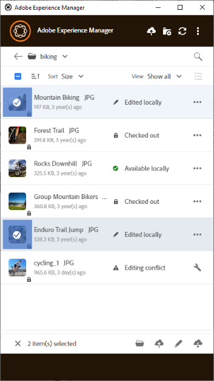

# Trabajo con varios recursos {#work-with-multiple-assets}

Los usuarios pueden trabajar con varios recursos y administrarlos fácilmente mediante acciones como cargar todas las ediciones de una sola vez o cargar carpetas anidadas en unos pocos clics.

## Examen de carpetas grandes {#browse-large-folders}

Cuando trabaje con carpetas que contengan muchos recursos, desplácese para ver más recursos. Para desplazarse con el teclado, pulse la pestaña varias veces para seleccionar el recurso en la parte superior. Observe el recurso resaltado para saber cuándo está seleccionado. Ahora, utilice la tecla Flecha abajo para desplazarse por la lista de recursos.

## Acciones rápidas para los recursos seleccionados {#quick-actions-for-selected-assets}

Haga clic en la miniatura de algunos recursos para seleccionarlos. Para seleccionar todos los recursos, haga clic en la casilla de verificación situada en la barra superior de la aplicación. El conjunto de acciones aplicables a todos los recursos seleccionados de forma colectiva se muestra en una barra de herramientas en la parte inferior de la aplicación.

Las acciones disponibles en la barra de herramientas de la parte inferior dependen del estado de los archivos seleccionados. Por ejemplo, si solo selecciona **[!UICONTROL Edited Locally]** archivos, verá el icono **[!UICONTROL Upload Changes]**. Si selecciona una combinación de **[!UICONTROL Edited locally]** y **[!UICONTROL Cloud only]**, la acción **[!UICONTROL Upload Changes]** no estará disponible.

## Próximos pasos {#next-steps}

* [Vea un vídeo para empezar a usar la aplicación de escritorio de Adobe Experience Manager](https://experienceleague.adobe.com/en/docs/experience-manager-learn/assets/creative-workflows/aem-desktop-app)

* Proporcione comentarios sobre la documentación usando [!UICONTROL Edit this page]  o [!UICONTROL Log an issue] , disponibles en la barra lateral derecha

* Contacto con el [Servicio de atención al cliente](https://experienceleague.adobe.com/es?support-solution=General#support)

>[!MORELIKETHIS]
>
>* [Cargar recursos](/help/using/upload-assets.md)
>* [Descarga de recursos](/help/using/download-assets.md)
>* [Buscar](/help/using/search.md)
